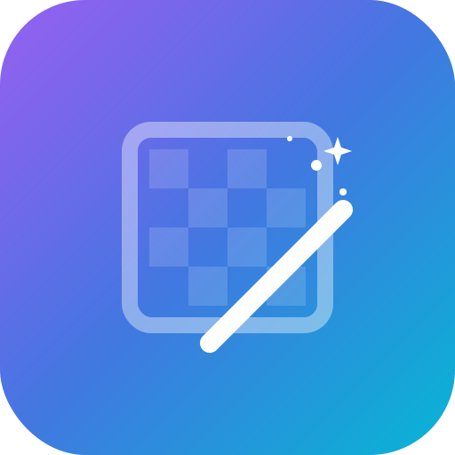

# Adiós BG

<div align="center">
  
  <h3>Elimina fondos de imágenes directamente en tu navegador, 100% privado y offline.</h3>
  <br>
  <a href="https://devadamza.github.io/adios-bg/"><strong>👉 Probar Live Demo 👈</strong></a>
</div>

---

**Adiós BG** es una Progressive Web App (PWA) construida con Vanilla JS y Web Components que permite eliminar el fondo de las imágenes utilizando Inteligencia Artificial, pero **sin enviar tus fotos a ningún servidor**. Todo el procesamiento pesado ocurre de forma local en el dispositivo del usuario.

## ✨ Características Principales

- **100% Client-Side**: Respeto total a tu privacidad. Las imágenes nunca abandonan tu navegador.
- **Inteligencia Artificial Local**: Integración del modelo `briaai/RMBG-1.4` (versión cuantificada ~44MB) gracias a [Transformers.js](https://huggingface.co/docs/transformers.js/index) impulsado por aceleración de hardware WebGPU / WebAssembly.
- **Offline By Default**: Funciona como una PWA. Tras la primera carga, los modelos se almacenan en caché vía Service Worker y la app funciona completamente sin conexión a Internet.
- **Multihilo (Web Workers)**: La UI principal nunca se congela. El flujo de Computer Vision y Machine Learning corre de manera optimizada en hilos separados usando `OffscreenCanvas`.
- **Diseño Premium**: Interfaz moderna basada en Dark Mode Glassmorphism. Cero dependencias CSS como Tailwind/Bootstrap.
- **Componentes Vanilla**: Arquitectura modular con Web Components nativos (`<ar-dropzone>`, `<ar-editor>`, `<ar-progress>`) sin la sobrecarga de frameworks como React o Vue.

## 🛠️ Stack Tecnológico

- **Frontend Core**: HTML5, Vanilla JavaScript, CSS3
- **Arquitectura**: Web Components (Custom Elements, Shadow DOM), Web Workers, Service Workers
- **Machine Learning**: `ONNX Runtime Web`, `@huggingface/transformers`
- **Algoritmos y CV**: Alpha Matting y Edge Refinement implementados en JavaScript puro para un halo ultralimpio.
- **UI/UX**: Variables sintácticas nativas (Design Tokens), animaciones ligeras.

## 🚀 Cómo usar localmente

Para ejecutar la aplicación localmente, solo necesitas servir la carpeta raíz usando cualquier servidor HTTP estático (ya que no se requiere Backend). Por ejemplo:

1. Clona este repositorio.
2. Si tienes Node.js, ejecuta:
```bash
npx serve .
```
3. O usando Python:
```bash
python3 -m http.server 3000
```
4. Abre [http://localhost:3000](http://localhost:3000) en tu navegador.

## 📝 Licencia / Notas de uso

- El código base de esta interfaz es de código abierto.
- **Precaución**: Esta app utiliza por defecto el modelo `briaai/RMBG-1.4`. Por favor, revisa la licencia comercial específica de [BRIA AI](https://huggingface.co/briaai/RMBG-1.4) antes de desplegar este entorno para fines comerciales o de lucro de manera masiva.
